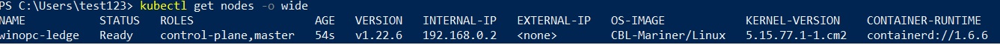
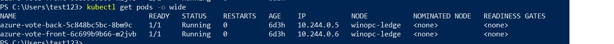

# AKS Edge Essentials Installation 

## Lab Overview  
In this lab, you will begin by reviewing the AKS Edge Essentials (aka AKS EE) deployment prerequisites and setup the machine to start the deployment. You will need to download and install the k8s or k3s installer for AKS EE, then use the deployment CLI with configuration to complete single machine deployment on Azure VM or physical machine, or multiple node cluster deployment on physical machine.
  
In summary, the lab includes the following exercises:  
* Review the hands on Lab Prerequisites
* Install AKS EE k8s/k3s installer on each node
* Implement Single machine deployment in a Azure VM
* Extend: Implement full deployment with multiple nodes

## Lab Prerequisites
* Hardware requirements  

| Specs | Requirement                |
| :------------- | :--------------------------- |
| Memory | 4 GB at least 2 GB free (cluster-only), 8 GB (Arc and GitOps) |
| CPU       | Two logical processors, clock speed at least 1.8 GHz |
| Disk space        | At least 14 GB free |
| Host OS        | Windows 10/11 IoT Enterprise/Enterprise/Pro and Windows Server 2019, 2022 |

## Lab Instructions

### Exercise 1: Setup your machine and install AKS EE

In this lab, we will use Azure virtual machine to do a single machine setup and deployment.

#### Step 1: Create an Azure virtual machine with Windows 11 Pro installed.  
  
1. Sign in to Azure  
Sign in to Azure portal at: https://portal.azure.com.

2. In Azure portal, click **Create a resource**, select **Create** in the **Virtual machine** to open the **Create a virtual machine** page

3. Create the VM with below settings  
    

* **Resource group**: your resource group name, ex: aks-edge-ee-lab-< your name >
* **Virtual machine name**: your vm name, ex: aks-edge-ee-< your name >
* **Region**: your Azure region.
* **Image**: Use the **Windows 11 Pro, version 22H2 - Gen2**
* **Size**: Use the **Stardard D4ds_v5 - 4vcpus, 16GB memory**  

* **Inbound port**: Allow inbound port rules for RDP connection as below

    

    Select **Review + Create** button at the bottom of the page to create virtual machine.

#### STEP 2: Connect into the Windows 11 Pro virtual machine  
1. Once the virtual machine is created, go to the **Overview** page, select **Connect** then **RDP** to download the RDP file to your local machine.
2. Double click the downloaded RDP file to connect into the virtual machine.

#### STEP 3: Enable Hyper-V features for Windows

1. Open a PowerShell console as Administrator, run following command:  
    ```bash
    Enable-WindowsOptionalFeature -Online -FeatureName Microsoft-Hyper-V -All
    ```
2. Restart the virtual machine to enable hyper-v feature.

3. Check if Hyper-V is enabled using following command:
    ```bash
    Get-WindowsOptionalFeature -Online -FeatureName *hyper*
    ```

#### STEP 4: Install K8S or K3S in Windows 11 Pro
AKS EE can be deployed on either a single machine or on multiple machines forming a cluster. For both cases it must install AKS EE on each of the machines using the installer showed [HERE](https://learn.microsoft.com/en-us/azure/aks/hybrid/aks-edge-howto-setup-machine#download-the-installer) to install K8S or K3S as its Kubernetes distribution, but for the same cluster you can only install the same Kubernetes distribution(k8s or k3s) and can't mixed.  

In this lab, we will use the K8S as Kubernetes distribution but you can deside if you want K3S, the installation steps is similar.

1. Download K8S installer  
    Download K8S installer from this [link](https://aka.ms/aks-edge/k8s-msi).

2. Install K8S  
    Double-click the downloaded **AksEdge-K8s-0.7.22335.1024.msi** to start installation.  

3. Verify the installation

    Run below command in Powershell to list the AksEdge module: 
    ```bash
    Get-Command -Module AksEdge
    ```

    and below command to show the AksEdge version
    ```bash
    (Get-Module AksEdge -ListAvailable).Version
    ```
Now you are already setup your machine as Linux node. 

**OPTIONAL**: If you also want to add Windows node support to the machine please take below additional steps:

1. Download the Windows node files from this [Link](https://aka.ms/aks-edge/windows-node-zip) and extract to a folder  
2. Copy the AksEdge-k8s-0.7.22335.1024.msi file to extracted folder
3. Open Powershell as Administrator and navigate to folder above that contains the Windows node files.
4. Run below command to start install
    ```bash
    msiexec.exe /i AksEdge-k8s-0.7.22335.1024.msi ADDLOCAL=CoreFeature,WindowsNodeFeature
    ```
4. Now you are ready to do **Linux & Windows** node mixed deployment

Please **NOTE** once again, you must do above steps in each machine in your cluster to setup your machines before making AKS EE deployment in the next lab sections. 
  
### Exercise 2: Implement single machine deployment

#### STEP 1: Single machine deployment
You can run the New-AksEdgeDeployment cmdlet to deploy a single-machine AKS EE cluster with a single Linux control-plane node, however we need to pass ServiceIpRangeSize = 10, which is not a default option. On single machine cluster, if you deployed your Kubernetes cluster without specifying a -ServiceIPRangeSize, you will not have allocated IPs for your workload services and you won't have an external IP address. Hence we will use the JSON object and pass it as a string:

```bash
$jsonString = New-AksEdgeConfig -outFile .\mydeployconfig.json
$jsonObj = $jsonString | ConvertFrom-Json 
$jsonObj.EndUser.AcceptEula = $true
$jsonObj.EndUser.AcceptOptionalTelemetry = $true
$jsonObj.LinuxVm.CpuCount = 4
$jsonObj.LinuxVm.MemoryInMB = 8192
$jsonObj.LinuxVm.DataSizeinGB = 40
$jsonObj.Network.ServiceIpRangeSize = 10

New-AksEdgeDeployment -JsonConfigString ($jsonObj | ConvertTo-Json)
 ```

  

    
#### STEP 2: Confirm if the deployment succeed

Confirm that the deployment was successful the Mariner VM is listed with hcsdiag, WSSD Agent is operational and the pods are running by running:

```bash 
hcsdiag list
kubectl get nodes -o wide
kubectl get pods -A -o wide
 ```
Describe some of the pods' resources in verbose mode: 

```bash 
kubectl describe pod kube-apiserver -n kube-system
 ```
 
Collect the AKS EE Logs after the deployment and review them as they are all information you need for troubleshooting on one place. 

```bash 
Get-AksEdgeLogs
 ```
The Get-AksEdgeLogs cmdlet collects all the logs from the AKS EE deployment and installation. It compresses them and outputs the bundled logs in the 
form of a .zip folder normally created here C:\ProgramData\AksEdge\logs\

 

 

PS: Multi-node AKS EE on Windows will not work on Azure because it will not allow to create Hyper-V external virtual switch due to the limit of Azure network backbone, but we can create external swithch on Physical PC's Hyper-V, then it's possible to create a VM on the same Hyper-V host to communicate with the mariner VM via that external switch with the local ip in the pysical pc's local network. 


### Execise 3: Deploy a sample application to AKS EE

#### STEP 1: Deploy the sample application  

We have a sample application that is a basic voting app consisting of a front and back end, which is based on Microsoft's azure-vote-front image. The container image for this application is hosted on Microsoft Container Registry (MCR)

You can find the sample yaml file at location AKS-Edge/samples/others/linux-sample.yaml

To deploy your application, use the kubectl apply 

```bash 
kubectl apply -f linux-sample.yaml
```

Wait a few minutes for the pods to be in the running state. Please run the command below after that

```bash
kubectl get pods -o wide
```




To check the external IP and port, please use the command below

```bash
kubectl get services
```

Initially, the EXTERNAL-IP for the azure-vote-front service is shown as pending. When the EXTERNAL-IP address changes from pending to an actual public IP address, you can use the IP address assigned to the service.

    

PS: On single machine clusters, if you deployed your Kubernetes cluster without specifying a -ServiceIPRangeSize, you will not have allocated IPs for your workload services and you won't have an external IP address (in this case, find the IP address of your Linux VM with Get-AksEdgeNodeAddr command)

#### STEP 2: Test your application 

To see the application in action, open a web browser to the external IP address of your service, no need to append the external port as it has been mapped to the http default port 80.


