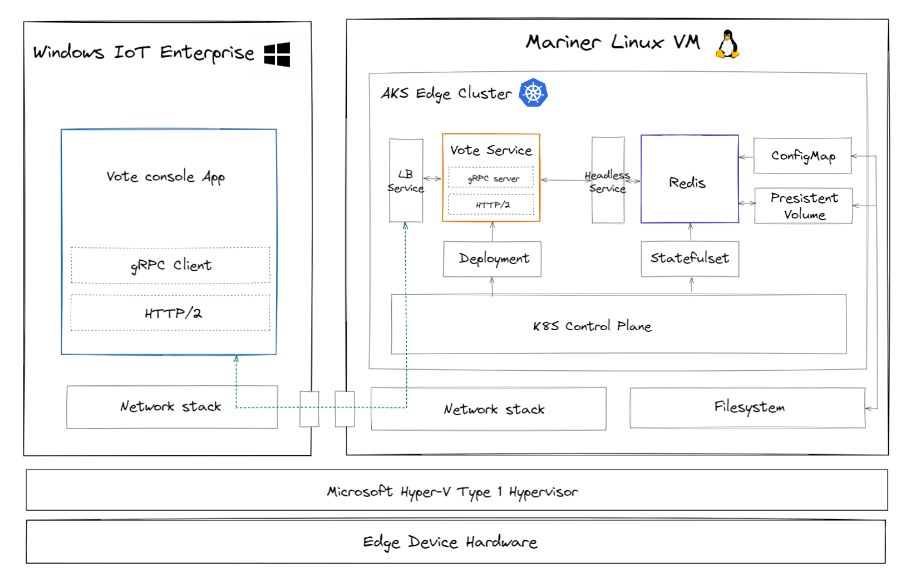

# Interop Windows Console App with AKS Edge Linux container using gRPC

## Introduction

This sample demonstrates bidirectional communication between a Windows console application and services running inside the AKS Edge cluster. 

The underlying communication between the Windows console application and the containerized services in AKS Edge is based on [gRPC](https://grpc.io/), a high performance, open source universal Remote Procedure Call (RPC) framework which is very suitable in such kind of local network, loosely coupled interop scenario. More benfits:

1. gPRC is strong typed based on protobuf IDL, this makes distributed application development more stable, as static typing helps to overcome most of the runtime and interoperability errors when you building micro services that span across different domain. 
2. gPRC is Binary encoded and much more effective than text based protocol like HTTP and REST. Also, lower overhead means higher perofrmance, which makes it ideal for inter-process communication between Windows and Linux. 
3. gRPC is lanauge agnostic and support natively code generation tool for client/server applications User can star with skill they already have in Windows and Linux developer ecosystem. 

## Architecture



## Services running on AKS Edge

A NodeJS Vote service application is containerlized and deployed together with a simple Redis server onto AKS Edge Cluster. This vote service exposes a set of well-defined gRPC APIs to Windows client, and use Redis as a KV database to perform high performance read/write operations and implement data presistence. 

## Windows console app 

The Windows console application provide a command line user interface to support voting and result visualization. It is written in C# and runs on .NET 6 environment. The console app, act as a 'front-end' of this sample, is being implemented as a *companion app* that runs side-by-side with the 'back-end' Vote service.

> As a demo, security is not implemented for simplicity. The RESP communication between Redis and Vote service, as well as gRPC communicadtion between Vote service and Windows console app are not authenticated or encrypted. But in a production scenario, both protocol and services can be configured to use TLS as secure transport layer. 

## APIs

Th servicee API is defined in protobuf format. Data serializaiton and gRPC stub code are auto-generated by protobuf code generator for both client and server using different lanauge extension/utilits. 

Pseudo code:

```
struct item {
    string name
    int ticket
}

// get all vote
[]item GetVote()

// vote
item Vote(string name)

// reset vote
int Reset()
```

## Prerequisites

To exercise this sample, you'll need the following:

* A single deployment of AKS Edge Cluster is up and running on a Windows device. If you haven't done this step, please complete [AKS Edge Essentials Installation](../install/install.md) session first. 
* An [Azure Subscription](https://azure.microsoft.com/free/) in which you have rights to deploy resources. 
* An [Azure Container Registry](https://docs.microsoft.com/en-us/azure/container-registry/container-registry-get-started-portal?tabs=azure-cli) in which you have right to push and pull containers.
* [Docker Desktop](https://www.docker.com/products/docker-desktop/) installed to build and push container.
* Install [.NET 6 SDK](https://dotnet.microsoft.com/en-us/download/dotnet/6.0), [Visual Studio Code](https://code.visualstudio.com/) and [C# for Visual Studio Code](https://marketplace.visualstudio.com/items?itemName=ms-dotnettools.csharp) to build and run Windows console applciation.

## Hands-on Lab instructions

- [Step 1 - Build and push service container to Azure Container Registry](./doc/01_build_and_push.md)
- [Step 2 - Deploy services onto AKS Edge Cluster](./doc/02_deploy.md)
- [Step 3 - Build and run Windows console application](./doc/03_win_app.md)
